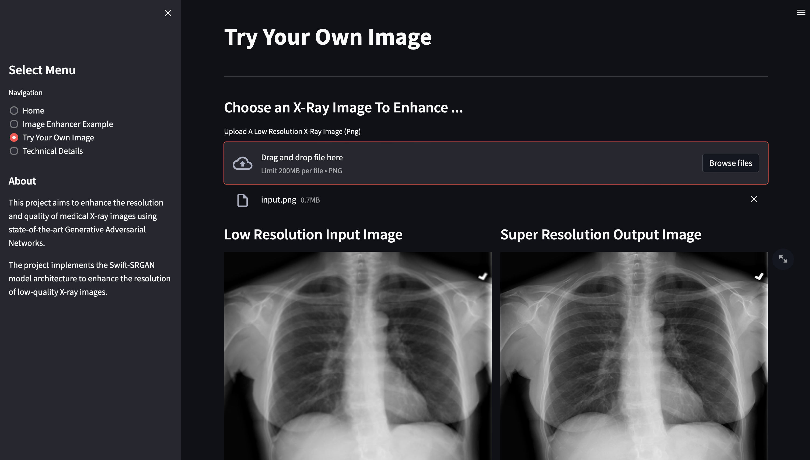

# Super Resolution for Medical Images ☠️
> #### _Archit | Spring '23 | Duke AIPI 540 Final Project_
&nbsp;


## Project Description ⭐  
The `Aim` of this project is to train and understand the working of SRGAN and Swift-SRGAN models on my proposed dataset of Chest X-rays. I will be downscaling high quality images from the dataset to generate low-resolution images (256x256). Then the generator will train to produce high-quality upscaled images (1024x1024), and these generated images will be compared against the original ground truths by the discriminator.  

&nbsp;  
You can find the detailed project implementation and description on the [`main`](https://github.com/architkaila/Super-Resolution-for-Medical-Images) branch  

&nbsp;  
## Running the demo (StreamLit App) 🧪  
The Streamlit-based web application is hosted live and can be accessed [here](https://image-super-resolution.streamlit.app/?page=Home)  

**1. Clone this repository and switch to the streamlit-demo branch**
```
git clone https://github.com/architkaila/Super-Resolution-for-Medical-Images
git checkout streamlit-demo
```
**2. Create a conda environment:** 
```
conda create --name st_demo python=3.9.16
conda activate st_demo
```
**3. Install requirements:** 
```
pip install -r requirements.txt
```
**4. Run the application**
```
streamlit run streamlit_app.py
```
**5. StreamLit Appication:**  
* Here you can play around with the streamlit demo  
>   


&nbsp;  
## Project Structure 🧬  
The project data and codes are arranged in the following manner:  

```
├── components                          <- directory for streamlit pages UI
    ├── about_us.py                     <- python file with UI for Technical Description of Project
    ├── home_page.py                    <- python file with UI for Default page and usage instruction
    ├── image_enhancer.py               <- python file with sample images for SR demo
    ├── new_image_enhancer.py           <- python file for running SR demo on new images
├── data                                <- directory for project data
    ├── images                          <- static images used in webapp
    ├── sample_xrays                    <- sample x-ray image examples for demo
├── model                               <- directory for running model inference
    ├── model_config.py                 <- script to configure the Generator
    ├── models.py                       <- script with the Geenrator architecture
    ├── netG.pth.tar                    <- best model weights for the Generator
    ├── run_inference.py                <- script to generate SR image from LR image using Generator
├── README.md                           <- description of project and how to set up and run it
├── requirements.txt                    <- requirements file to document dependencies
```  


&nbsp;  
## References 📚   
1. NIH Chest X-rays Dataset from Kaggle [(link)](https://www.kaggle.com/datasets/nih-chest-xrays/data)  

2. Photo-Realistic Single Image Super-Resolution Using a Generative Adversarial Network, May 2017, Christian Ledig et al. [(link)](https://arxiv.org/pdf/1609.04802.pdf)  

3. SwiftSRGAN - Rethinking Super-Resolution for Efficient and Real-time Inference, Nov 2021, Koushik Sivarama Krishnan et al. [(link)](https://arxiv.org/pdf/2111.14320.pdf)  

4. SRGAN Loss explanation [(link)](https://towardsdatascience.com/srgan-a-tensorflow-implementation-49b959267c60)  

5. Tensorflow implementation of SRGRAN [(link)](https://github.com/brade31919/SRGAN-tensorflow)


