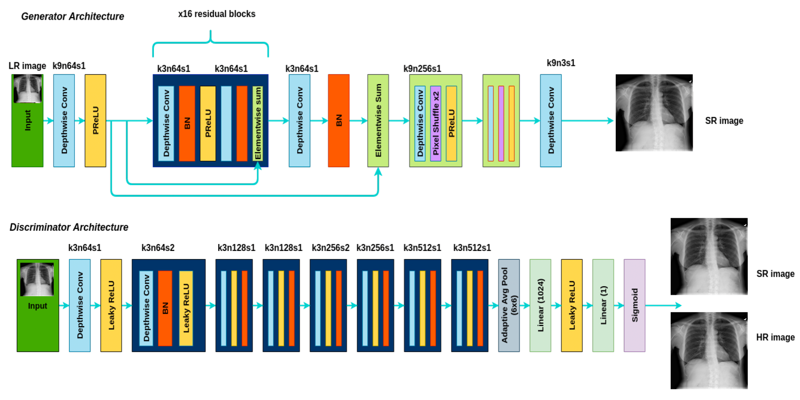

# Super Resolution for Medical Images ☠️
> #### _Archit | Spring '23 | Duke AIPI 540 Final Project_
&nbsp;

## Project Description ⭐  
The application of `Generative Adversarial Networks`(GANs) in Computer Vision and Deep Learning has always fascinated me. Among the many real-world applications of GANs, `Image Inpainting` stands out, as it involves filling in missing or corrupted parts of an image using information from nearby areas. One of the most crucial appliations of image inpainting is `Super-resolution` which is the process of recovering and reconstructing the resolution of a noisy low-quality image into a very high-quality, high-resolution image. Super Resolution can be applied to Medical imaging like MRIs, CT Scans or Xrays to fill in the missing or damaged areas, helping in more accurate diagnosis.

`Medical imaging` often involves capturing images using equipment that has limited resolution, such as X-ray machines or MRI scanners. This can result in images that are pixelated and blurry, making it difficult for doctors to identify key abnormalities. Moreover, to capture very high-resolution X-Ray images, the number of pixels captured by the detector need to be increased. But this in itslef isn't sufficent for high resolution images. The patient must be exposed to a larger amount of X-ray radiation to capture more detailed Chest X-rays, which can be harmful for humans. Typical X-rays imaging systems capture atleast 1024 x 1024 pixels and some systems even capture 3072 x 3072 pixels along with higher amount of radiation.

Instead of exposing patients to higher `radiation`, we can continue to capture just low-resolution X-ray images (~256 x 256 pixels) and apply image inpainting (super resolution) to enhance the resolution of these low-quality medical images. By inpainting missing or degraded areas of the image, the GAN can create a more detailed and visually appealing image. This can improve the accuracy of diagnosis and treatment, as doctors can see more clearly the details of a patient's condition.

There are many state-of-the-art architectures that have been developed previously for the purpose of super-resolution. A model that has not been used previously for medical X-Ray images is `SRGAN`. This is one of the earliest GANs that was developed for the super-resolution, and even though this performs very well, the main issue with this was it is highly compute intensive and slow. An improved version of the SRGAN called `SWIFT-SRGAN` was published in 2021. It focuses on improving the latency of the previous models for image super-resolution by reducing the computation size and introducing Depth-wise Separable Convolutions. This approach enables up-scaling low-resolution images into high-resolution images in real-time and with high efficiency, even on low-end computing devices, without compromising the clarity of the content.

The `Aim` of this project is to train and understand the working of SRGAN and Swift-SRGAN models on my proposed dataset of Chest X-rays. I will be downscaling high quality images from the dataset to generate low-resolution images (256x256). Then the generator will train to produce high-quality upscaled images (1024x1024), and these generated images will be compared against the original ground truths by the discriminator.  

&nbsp;  
**_Sample Results_**  
<table >
    <tr >
        <td><center>Low Resolution Input (256x256)</center></td>
        <td><center>Super Resolution Output (1024x1024)</center></td>
        <td><center>Orignal High Resolution (1024x1024)</center></td>
    </tr>
    <tr>
    	<td>
    		<center></center>
    	</td>
    	<td>
    		<center></center>
    	</td>
        <td>
        	<center></center>
        </td>
    </tr>
</table>


&nbsp;
## Data Sourcing & Processing 💾  
For this project the Dataset used to train the Super Resolution model is [NIH Chest X-ray](https://www.kaggle.com/datasets/nih-chest-xrays/data). This NIH Chest X-ray Dataset is comprised of 112,120 high resolution X-ray images with disease labels from 30,805 unique patients. Even though this dataset is primally for lung disease identification, I striped off the labels for each image and instead use these high-resolution X-ray images for training my super-resolution GAN.

The original images have a high resolution of 1024 x 1024. To prepare this dataset for training a super resolution GAN, I downsampled the orignal high resolution images to 256 x 256 (one fourth) using BICUBIC interpolation from the PIL module. The downsampled images are served as an input to the generator architecture which then tries to generate a super resolution image which is as close as possible to the original higher resolution images. The data preprocessing script `scripts/prepare_data.py` is a part of the custom Train and Val data loader classes and is run automatically during the model training part. The data can be donwloaded using a script `scripts/make_dataset.py` and split into train and validation datasets using `scripts/split_dataset.py`. The scripts can be run as follows:

**1. Create a new conda environment and activate it:** 
```
conda create --name image_super_res python=3.9.16
conda activate image_super_res
```
**2. Install python package requirements:** 
```
pip install -r requirements.txt 
```
**3. Run the data downloading script:** 
```
python ./scripts/make_dataset.py
```
Running this script would prompt you to type your kaggle username and token key (from profile settings) in the terminal. Following that the data would be donwloaded and available in the `./data/` directory.

**4. Split the dataset into train and validation:** 
```
python ./scripts/split_dataset.py
```
This would create two files in the `./data/` directory called `train_images.pkl` and `val_images.pkl` which would store the paths to train and validation split of images


&nbsp;
## Model Architecture 🧨  
I have implemented the original [Swift-SRGAN](https://arxiv.org/pdf/2111.14320.pdf) model architecture to enhance the resolution of low-quality X-ray images. The authors trained the original Swift-SRGAN on [DIV2K](https://data.vision.ee.ethz.ch/cvl/DIV2K/) dataset and the Flickr2K dataset. I have customized this network architrcture for Chest X-Ray images using the [NIH Chest X-ray](https://www.kaggle.com/datasets/nih-chest-xrays/data) dataset. The Generative network was trained on a proposed dataset of Chest X-rays. Given an input image of size 256 x 256, the `Generator` generates a super-resolution image of size 1024 x 1024. The generated super resolution images are evaluated against the original high resolution images available in the dataset by the `Discriminator`.  
>  

<br>  

**_Generator Architecture_**  
The generator consists of Depthwise Separable Convolutional layers, which are used to reduce the number of parameters and computation in the network. The major part of network is created of 16 residual blocks. Each block has a Depthwise Convolution followed by Batch Normalization, PReLU activation, another Depthwise Convolution, and Batch Normalizationa and finally a skip connection. After the residual blocks, the images is passsed thourgh upsample blocks and finally thourgh a convolution layer to generate the final output image.

<br>  
 
**_Discriminator Architecture_**  
The discriminator consists of 8 Depthwise Separable Convolutional blocks. Each block has a Depthwise Convolution followed by Batch Normalization and LeakyReLU activation. After the 8 blocks the images is passed through Avg Pooling and a fully connected layer to generate the final output. The objective of the discriminator is to classify super-resolution images generated by the geenrator as fake and original high-resolution images as real.  


&nbsp;
## Model Training and Evaluation 🚂  

The GAN model was evaluated and compared against ground truths using different metrics like Peak Signal to Noise Ratio (PSNR) and Structural Similarity Index (SSIM). 
- The PSNR is calculated by comparing the original signal to the processed signal, and it is expressed in decibels (dB). The higher the PSNR value, the less distortion or loss of information there is in the processed signal compared to the original signal.
- Similarly, SSIM lies between -1 and 1 and a higher SSIM score indicates a higher similarity between the two images structurally. 
- Compared to PSNR, SSIM is often considered a more perceptually accurate metric, as it takes into account the human visual system's sensitivity to changes in luminance, contrast, and structure.

The model was trained on RTX6000 with a batch size of 16. Following are the metrics obtained after training the models on full dataset for 10 epochs:  

            
| Metric                              |   10 Epochs (Xray Data)   |   1 Epochs (Xray Data)   |   Original SRGAN Paper   |
| ----------------------------------- | :-----------------------: | :----------------------: | :----------------------: |
| Peak Signal to Noise Ratio (PSNR)   |            41.66 (dB)     |            30.37 (dB)    |            29.40 (dB)    |
| Structural Similarity Index (SSIM)  |            0.96           |            0.83          |            0.79          |  
  

&nbsp;
### Following are the steps to run the model training code:

**1. Activate conda environment:** 
```
conda activate image_super_res
```
**2. To train the model using python script** 
- You can train a model direcltly by runnning the driver python script : `scripts/train_model.py`
- You can pass `batch_size`, `num_epochs`, `upscale_factor` as arguments
- You will need a GPU to train the model
```
python ./scripts/train_model.py  --upscale_factor 4 --num_epochs 10 --batch_size 16
```
**5. Model checkpoints and results** 
- The trained genertor and Discriminator are saved to `./models/` directory after every epoch. The save format is `netG_{UPSCALE_FACTOR}x_epoch{epoch}.pth.tar`
- The metrics results are saved a csv to the `./logs/` folder with the filename `metrics_{epoch}_train_results.csv`  
  
&nbsp;
## Risks and Limitations ⚠️  
1. Generative networks may struggle to accurately capture important details in extremely low resolution medical X-ray images (< 128 x128), which could negatively impact the generated high quality images. 
2. The network may generate features that dont exist in the original low resolution images.
3. The use of generative networks in medical imaging raises ethical concerns around issues such as bias, accountability, and transparency.  

To minimize the risk of the above mentioned biases, the model was trained on a diverse dataset of X-ray images. Furthermore, addtion of perceptual loss to the model helps to ensure that the generated images are similar to the original images and no new features are generated while generating the super resolution images.  

&nbsp;
## Custom Loss Function 🎯  
I have used the same loss function mentioned by the authors of the Swift-SRGAN or SRGAN paper. The loss function for the Generator is a combination of multiple losses, each weighted and added together. The most crucial loss is the Perceptual Loss which is a combination of Adversarial Loss and Content Loss.
&nbsp;  
```
Total_Loss = Image_Loss + Perception_Loss + TV_Loss
```
```
Perceptual_Loss = Adversarial_Loss + Content_Loss
```  

&nbsp;  
**_Loss 1: Image Loss_**  
This is a naive loss functionn whihc calculates the Mean Squared Error b/w the generated image and the original high res image pixels.  
  
&nbsp;  
**_Loss 2: Content Loss_**  
It represents the information that is lost or distorted during the processing of an image. The image generated by the generator and the original high res image are passed though the MobileNetV2 network to compute the feature vectors of both the images. Content loss is calculated as the euclidean distance b/w the feature vectors of the original image and the generated image.  
  
&nbsp;  
**_Loss 3:  Adversarial Loss_**  
It is used to train the generator network by providing a signal on how to improve the quality of the generated images. This is calculated based on the discriminator's output, which indicates how well it can distinguish between the real and fake images. Generator tries to minimize this loss, by trying to generate images that the discriminator cannot distinguish.  
  
&nbsp;  
**_Loss 4:  Total Variation loss_**  
It measures the variation or changes in intensity or color between adjacent pixels in an image. It is defined as the sum of the absolute differences between neighboring pixels in both the horizontal and vertical directions in an image.  
  

&nbsp;  
## Running the demo (StreamLit App) 🧪  

**1. Clone this repository and switch to the streamlit-demo branch**
```
git clone https://github.com/architkaila/Super-Resolution-for-Medical-Images
git checkout streamlit-demo
```
**2. Create a conda environment:** 
```
conda create --name st_demo python=3.9.16
conda activate st_demo
```
**3. Install requirements:** 
```
pip install -r requirements.txt
```
**4. Run the application**
```
streamlit run streamlit_app.py
```
**5. StreamLit Appication:**
* You can find the code for streamlit application on the [`streamlit-demo`](https://github.com/architkaila/Super-Resolution-for-Medical-Images/tree/streamlit-demo) branch
* [Click Here](https://github.com/architkaila/Super-Resolution-for-Medical-Images/blob/streamlit-demo/README.md) for the streamlit documentation 
* Here you can play around with the streamlit demo  

&nbsp;  
## Project Structure 🧬  
The project data and codes are arranged in the following manner:

```
├── assets                              <- directory for repository image assets
├── data                                <- directory for project data
    ├── train_images.pkl                <- list of image paths used for training the model
    ├── val_images.pkl                  <- list of image paths for testing the model
├── notebooks                           <- directory to store any exploration notebooks used
├── scripts                             <- directory for data processing and model training scripts
    ├── custom_loss.py                  <- script to compute custom loss for generator model
    ├── make_dataset.py                 <- script to donwaload the dataset from kaggle
    ├── model_architecture.py           <- script to define the generator and discriminator model architecture
    ├── model_metrics.py                <- script to calculate metrics 
    ├── prepare_data.py                 <- script to preprocess data and create train and val data loaders
    ├── split_data.py                   <- script to split the dataset images into train and validation
    ├── train_model.py                  <- script to train the models
├── .gitignore                          <- git ignore file
├── README.md                           <- description of project and how to set up and run it
├── requirements.txt                    <- requirements file to document dependencies
```  


&nbsp;  
## References 📚   
1. NIH Chest X-rays Dataset from Kaggle [(link)](https://www.kaggle.com/datasets/nih-chest-xrays/data)  

2. Photo-Realistic Single Image Super-Resolution Using a Generative Adversarial Network, May 2017, Christian Ledig et al. [(link)](https://arxiv.org/pdf/1609.04802.pdf)  

3. SwiftSRGAN - Rethinking Super-Resolution for Efficient and Real-time Inference, Nov 2021, Koushik Sivarama Krishnan et al. [(link)](https://arxiv.org/pdf/2111.14320.pdf)  

4. SRGAN Loss explanation [(link)](https://towardsdatascience.com/srgan-a-tensorflow-implementation-49b959267c60)  

5. Tensorflow implementation of SRGRAN [(link)](https://github.com/brade31919/SRGAN-tensorflow)


